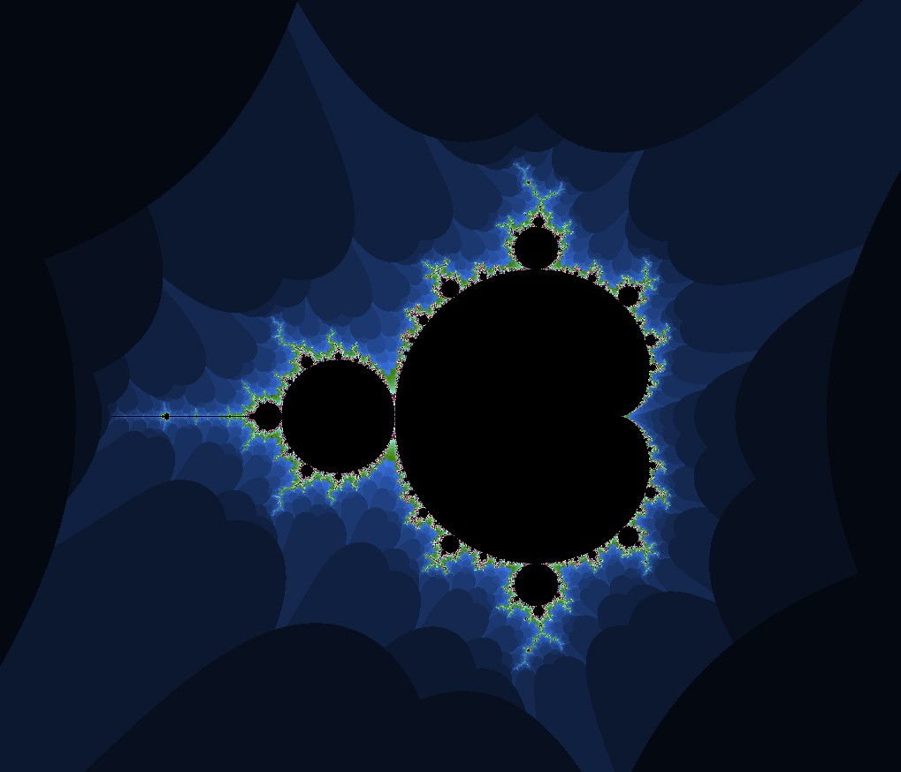

# Parallel Mandelbrot rendering on CUDA

This is a simple CUDA program that **renders the Mandelbrot set in parallel**. It is just a sample testbed to learn about using CUDA for parallel programming.

This **code is pretty buggy** and does not give the right results for all inputs, but it is a good enough demonstration for CUDA

## Usage

```bash
./cudaMandelbrot <SCREEN_WIDTH> <MAX_BOUNCES> <MIN_BOUNDS_X> <MIN_BOUNDS_Y> <MAX_BOUNDS_X> <MAX_BOUNDS_Y> <UOFFSET> <VOFFSET>
```

You need OpenCV and CUDA toolkit (obviously) to compile this code. The CMakeLists.txt file is provided for convenience.

**The code is tested on Linux only, I have no idea if it compiles on Windows, and if it does, will it work correctly!**

The code demonstrates an **improvement of 250-300x** over the serial CPU version of the code, which may be more significant as the input size grows!

## Sample output



